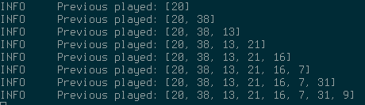

# Mopidy Software Evolution

## Table of Contents
- [Mopidy Software Evolution](#mopidy-software-evolution)
    - [Introduction](#introduction)
    - [Identify Feature](#identify-feature)
    - [Components of the Feature](#components-of-the-feature)
    - [Evolution of the Feature](#evolution-of-the-feature)
    - [Submission of Patch](#submission-of-patch)

## Introduction

As new requirements are laid upon the existing software there is the need for the product to evolve and respond to remain useful.
Since software products can be extensively complex, this evolution can be extremely expensive and difficult, so there are specific processes to make it happen with ease.

As a closure to our semester research, our group was assigned to identify a possible feature for this open-source project and develop/create it. Although the group members lack the knowledge of Python we still believe this task to be feasible.
 
## Identify Feature

After a lot of debate, the group decided to settle for a relatively easy feature to implement but still quite useful for Mopidy users nonetheless.

The feature chosen is the possibility of being able to go to previous played songs while in random mode.
The previous behaviour was nonexistant.
Basically, when trying to seek back in track history while random mode was on, the server would simply replay the currently playing song.

With this in mind, we hoped to have achieved what is in general a standard feature in various music players, which is playlist shuffling: randomizing the order of the tracks in a playlist and being able to navigate back and forward at ease.

## Components of the Feature

In order to implement this feature we had to add some behaviour to the methods
[`next_track`](https://docs.mopidy.com/en/latest/api/core/#mopidy.core.TracklistController.next_track),
[`previous_track`](https://docs.mopidy.com/en/latest/api/core/#mopidy.core.TracklistController.next_track)
and `_mark_playing`
of the [`TracklistController`](https://docs.mopidy.com/en/latest/api/core/#mopidy.core.TracklistController)
in [`mopidy.core.Core`](https://docs.mopidy.com/en/latest/api/core/#module-mopidy.core).

It was also necessary to add a new private variable in the [`TracklistController`](https://docs.mopidy.com/en/latest/api/core/#mopidy.core.TracklistController)
to hold the previously played tracks information in a list.

_Note: For more information the commit for the feature can be checked [here](https://github.com/quartz55/mopidy/commit/55426c26d903813d93749f8c402f9043f01af6c4)_

## Submission of Patch

Since code contribution to Mopidy is made in the form of Github's Pull Requests and those contributions need to include tests and documentation for any new features implemented, the group hasn't yet submitted a PR due to the lack of the previously mentioned points.

## Conclusion

The whole experience of reverse engineering an open-source project was very enlightening on what may possibly be our future in the IT market.
Dealing with poorly documented projects, to unreadable code , to projects that are bottlenecked at its conception might very well be our daily basis.
The concepts we learned and acquired while going through this project  are very important and this was a great experience to understand their reach.
