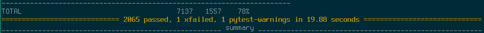

# Mopidy Software Verification and Validation

## Table of contents
- [Mopidy Software Verification and Validation](#mopidy-software-verification-and-validation)
    - [Introduction](#introduction)
    - [Degree of Testability](#degree-of-testability)
        - [Controllability](#controllability)
        - [Observability](#observability)
        - [Isolateability](#isolateability)
        - [Separation of concerns](#separation-of-concerns)
        - [Understandability](#understandability)
        - [Heterogeneity](#heterogeneity)
    - [Test Statistics](#test-statistics)

## Introduction

Verifying a piece of software is to ensure that both the intermediate as well as the final product conform to their specification and requirements.
On the other hand, to validate software is to make sure that the final product will fulfull its intended environment, mainly through the use of tests.

The main techniques used for verifying and validating (V&V) are **static techniques** and **dynamic techniques**:

- **Static techniques**: analyze the static system representations to both find problems/bugs and evaluate quality. This includes reviews, inspections, formal verification, etc.
- **Dynamic techniques**: execute the system and observe its behavior (software testing and simulation).

In Mopidy the software is constantly and consistently validated through the use of tools such as [Travis CI](https://travis-ci.org/mopidy/mopidy) which runs the test suite automatically when code is pushed to the repository as well as [coveralls.io](https://coveralls.io/github/mopidy/mopidy) which checks code coverage for every successful build.

The test suit uses [Tox](https://tox.readthedocs.org/en/latest/) with [pytest](http://pytest.org/latest/) as a backend for testing the python code, [Sphinx](http://sphinx-doc.org/) for documentation and finally [flake8](https://pypi.python.org/pypi/flake8) for code style.

Contributions to the project are also very strict as it is required to include tests for said code/features in order to be accepted upstream.

On the other hand verification is not as important, seeing as there isn't really a formal specification or requirements document.
Most of the functionality available came from user or developer requests.

## Degree of Testability

### Controllability

As described below in [Isolateability](#isolateability) the packages/modules are very well organized and isolated which, coupled with the use of Mock objects in tests makes it very easy to control the state of an object/component as required for testing.
Mopidy also makes use of some Dummy objects (like the audio, backend and mixer objects) to keep complexity low.
Those dummy objects only provide the basic interface required by the other modules in order to work without having to deal with actual audio output or backend functionality.

### Observability

Pytest itself only has a command-line interface (CLI) which, even tho results are nicely presented, it's not as good to analyze data as a graphical interface. It is for this reason that, as said before, Mopidy makes use of [coveralls.io](https://coveralls.io/github/mopidy/mopidy) to analyze test results as well as code coverage.

### Isolateability

Mopidy has unit tests for most modules, mostly because each contribution must include tests in order to be accepted, which means that the isolateability is achieved because everything is confined in its module.
Also, since the project is based in Python, developers can make use of the Python package [mock](https://pypi.python.org/pypi/mock) to reduce or eliminate the dependency on other objects by using Mock objects instead, keeping each test considerably isolated.

Pytest also makes it possible to do single unit tests. For example, testing a single directory:
`py.test tests/http/`

### Separation of concerns

Mopidy's source code is pretty organized, each package/module is separated into different folders, with each one trying to be as independent as possible, relying mostly on some global packages.
Consequently, it is easy to understand what each module is responsible for.
Besides that, Mopidy also provides a pretty good [documentation](https://docs.mopidy.com/en/latest/) that helps a lot to get around its struture and makes it easier to contribute to the project.

### Understandability

The modules and functionalities provided are self-explanatory.
The concepts that are implemented are very well documented as seen on [documentation](https://docs.mopidy.com/en/latest/) making it easy ,even for newcomers, to understand the reach of the tests that are currently done and creating new ones for the said components.
The tool used to write documentation is [Sphinx](http://sphinx-doc.org/) which is a python documentation generator making it possible to make a html where one can navigate through the components and check it's documentation.

### Heterogeneity

Through the use of [Travis CI](https://travis-ci.org) and [Tox](https://tox.readthedocs.org/en/latest/) and [pytest](http://pytest.org/latest/) all the submitted code is tested.Code coverage is  done using an external tool
[coveralls.io](https://coveralls.io/github/mopidy/mopidy). Considering that mopidy only runs on Linux and MacOSX these are enough to guarantee proper testing. All the extensions developed are also tested under the same tools although they are not subject to the same scrutiny which leads to some of them lacking documentation and testing entirely.

## Test Statistics

Running `tox -e py27` we get the following results:

A total of **2065** tests passed with a code coverage of **78%**.

After analyzing the source code we concluded that most, if not all of the tests in the project are unit tests.
Also, some of the packages still have no tests associated with them (like the "file" package).

Regarding code coverage, besides being a pretty high percentage, we also think the tests themselves are valid and provide good insight on whether the software is working as intended or not.
